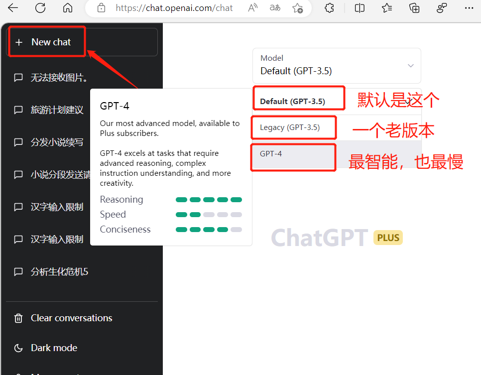

<h1 align="center">Welcome to chatgpt-plus-share 👋</h1>

  众所周知，chatgpt收费，鉴于很多同学想用，但是免费账号不满足的情况下，可以试试组队试用账号。

获取组队试用账号方法，登录系统 
https://share.smallsesame.site/admin/  
账号自己注册  
20元一个月，一个账号8个人。  

登录地址： https://chat.openai.com/auth/login (需要科学上网)  
账号 527948401@qq.com (已满8人，还需要可登录上述系统购买)  
密码 请加微信群，或通过上述系统获取  

【腾讯文档】组队账号常见问题 
https://docs.qq.com/doc/DRFNIU0xpZmpSTWNG  

沟通群： 

<h3>相关git：</h3> 
java代码调用： 
https://github.com/PlexPt/chatgpt-java   

python 
https://github.com/acheong08/ChatGPT  

微信对接 
https://github.com/fuergaosi233/wechat-chatgpt/blob/main/README_ZH.md  

有趣调教玩法： 
https://github.com/PlexPt/awesome-chatgpt-prompts-zh  

<h3>国内镜像，套壳的：</h3> 
https://chat.forchange.cn/ 
https://so.csdn.net/so/chat

  
<h3>常见问题</h3>

常规操作过程是啥？ 
●准备好浏览器，谷歌浏览器或者微软Microsoft Edge浏览器，其中一个就行。 
●打开魔法工具，或者科学工具，你身边人告诉你的那个工具。 
●输入网址 https://chat.openai.com/auth/login  点击登录  
●然后输入这个系统中得到的账号，就可以看到后台了，进去会发现有别人已经问过问题，新建自己的会话，咨询过程中有上下文关联，每次提问不用重复上一次的话。 

  

搞这个共享组队账号挣钱么？ 
大家可以算一下，8个人一人20，是160，开一个账号 20美金，按现在汇率，是138元，看起来还可以挣个22元，实际情况是，国内visa卡用不了，需要国外的，这就需要手续费了，同时还需要一个国外手机号，常见的免费的，几乎都用不了了，这个也需要花钱。算下来，成本大概是170~200之间。所以是微亏的状态。
  
不挣钱为啥要搞？ 
个人观点，这是一个新的趋势，在趋势面前，最好多关注，多了解，多找大模型跟自己工作有结合的点，这样你的价值会比别人更大。我认同一个观点： 总有人担心人工智能替代人类，实际上是擅长这个技术的人替代不擅长这个技术的人。所以多学习多掌握新技能，总归是好事。
  
这个东西微信和淘宝都屏蔽了，是合规的么 
目前没有哪个规定说国内不能使用chatgpt，连周鸿祎 李彦宏这些大佬，各个网红博主都在天天聊这个热点话题。
但是需要注意一点的是：国内不能宣传和讨论如何科学上网，有需要还是找身边的人咨询，我们这里也不能共享梯子 科学上网工具。
如果不科学上网，其实还有文心一言可以使用，效果是类似的，只是跟chatgpt相比还略差一点。
  
为啥总提示所在地区不支持访问？ 
当你在某个时间点，先打开登录地址，然后打开科学工具的时候，会提示当前地区不能访问，这个时候还会在你的浏览器上存一些信息，就算是打开了魔法，也上不了。这个时候，需要先清理下浏览器缓存，Ctrl + Shift + Del ，然后再先打开魔法，在打开登录地址，就可以了。
  
为啥总提示服务器占用资源，显示个邮箱输入框？ 
这个是因为同一个时间段，登录人太多，因为之前还有免费的账号在用，如果你是plus会员，可以输入自己的邮箱，点击发送。邮箱会受到一个专属的登录链接，点击后输入自己的账号密码，就可以使用了。
  
为啥使用的时候总提示同一时间，还有一个对话在生成？ 
这是因为，在别的会话框中，正在生成模型。同一时间，只能生成一个。这时稍等一会，点击重试，就可以了。另外最好人少的时候用，高峰时间一般在每天的下午那会儿。
  
为啥gpt4这么慢，gpt3.5的比较快？ 
因为gpt4的智能程度更高，模型参数更大，逻辑处理比上一代更强，白话就是干的活儿多，所以慢。 gpt3.5是之前版本的一个涡轮增压版，开车的朋友想想涡轮增压代表啥，是不是更快更有速度感。

